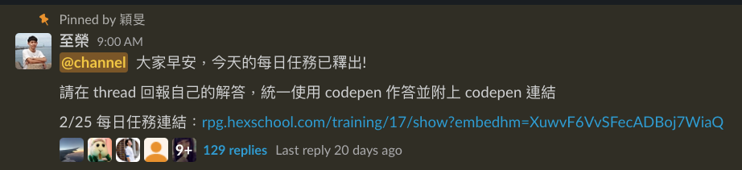
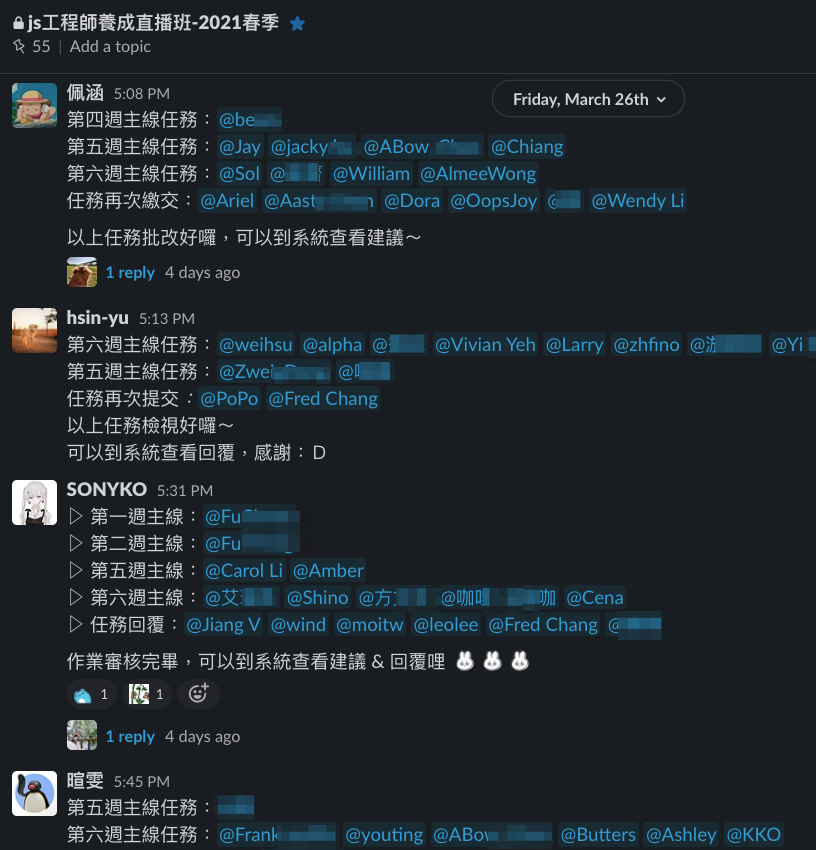
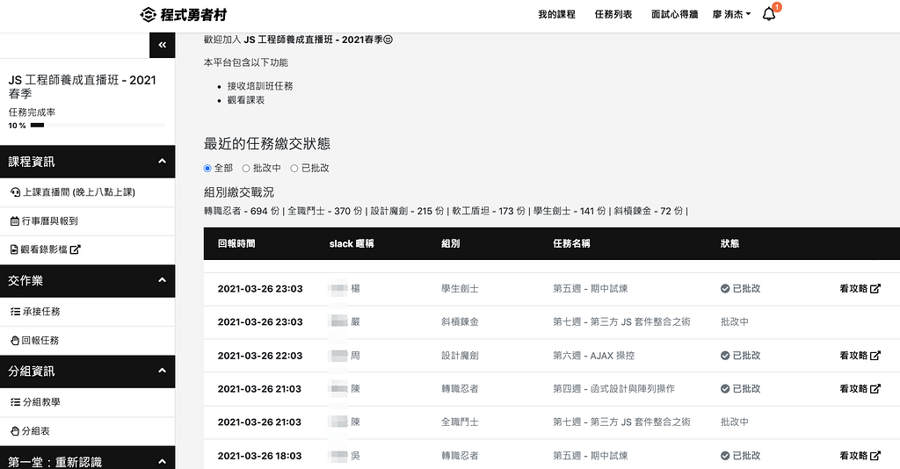

## 先說結論，推拉哪次不推｜六角學院JS直播班 完課心得

開設medium以來，沒想到第一篇文章就會是六角的完課心得。剛結束JS直播養成班，寫下我的過程心得給還在猶豫是否加入的你~

參考資源：

- [六角學院 JavaScript工程師養成直播班](https://www.hexschool.com/courses/js-training.html)
- [六角學院官網](https://www.hexschool.com/)

### 當初為什麼報名這堂課？

曾買過六角的HTML/CSS網頁設計課程，但邊上班邊學習的進度真的是三天打漁兩天曬網，太高估自己的自律性，也發現自己尚未養成學習習慣，導致一門課要很長時間才可以完成。

處於離職的轉換期，經過幾次面試後，下定決心在這段空窗期全職轉職前端工程師，而非上班自學斷斷續續。選擇直播班而非影音課程的原因，想**逼迫自己在短期間內學好JS基礎**，真實感覺(線上)有同學跟你一起在拚同一份作業，而且線上課適合遠離都市(懶得奔波)的人 😅

### 第一週~第八週的學習過程

#### 充實的課內資源量

每個禮拜分別會有：

- 影音課程
- 每週五晚上將近3小時的直播課
- 助教加碼教學
- Slack上小組討論和大群的主線任務討論
- 每天的每日任務

記得當初直播班的介紹是說FOR上班族想自我進修，每週至少10小時。

但實際是，每週投入在這門課的時間遠遠超過10小時啊！單就零基礎的我來說，隨著進程難度漸高，**每週投入逐漸超過30小時以上。**

抱著培養未來工作技能的心情，想完成每一項提供的作業和任務，並做到每個難度和等級都完成，每天也一定都會開Slack看討論串看大家的留言和程式碼討論，即使無法像吃記憶吐司一樣完全複製，但一定也可以從裡面學到幾個方便又神奇的新語法 (酷東西！)

除了上課教的文法以外，有時也會邊寫作業，邊把直接把不懂的東西丟google，找找看MDN找原本結構、有沒有大神寫得更多範例、或是鐵人幫系列文，不僅會找到更多超補的內容，也可以加深和加廣基礎觀念。個人覺得這蠻重要的，如果時間允許的話，做筆記也很好！

#### 除了課程以外

六角影音課程也會有同學，可以從評論中找到同學分享的解法或資源，但通常不會每一頁都點來看，單純看留言數也無法一目了然馬上了解那些留言有乾貨

這次直播班就有個同學在大群提供了codewar練習題，針對陣列篩選設計題目，做完15道題也真的讓我對這些工具更加熟悉，之後寫題目也方便快速許多~

[Coding Meetup #1 — Higher-Order Functions Series — Count the number of JavaScript developers coming from Europe](https://www.codewars.com/kata/coding-meetup-number-1-higher-order-functions-series-count-the-number-of-javascript-developers-coming-from-europe)

交作業的比例之高！

### 最大的收獲是？

有了雙螢幕(歡呼)(欸？不是

1. 培養學習習慣
2. 找到適合的筆記軟體與習慣

對於想要轉職的人來說，我認為上述兩項是在出發時必須具備的習慣，讓路途走得更遠更長 (但我也不是希望轉職過程拖太久QAQ

很幸運的，在直播班中算是摸到了這些習慣的邊邊。

#### 培養學習習慣

直播班有稱不上輕鬆的作業量，永遠比你更努力更認真的同學在寫作業，固定的上課時間，這三項原因會讓你想逼自己一定要在一個禮拜內完成所有任務(也可能是升學體制下的奴性基因?)，焦慮地想做完所有事，就算休息或睡覺也在焦慮，腦子在想code怎麼優化(希望我不是病了)，焦慮所以會挪出大量時間給資質駑鈍的自己，每天寫扣碰扣，時間長了，也真的可以感受到自己越來越熟悉鍵盤的字母位置、語法操作。

#### 找到適合的筆記軟體與習慣

(好像偏離課程心得了

初期用hackmd，後期全部轉移到Notion

有了大量的筆記需求後，會更了解自己適合哪個筆記軟體

喜歡hackmd左側的目錄查找，只要階層分類好，想要回頭複習筆記過的語法相當方便！如果熟悉Markdown語法，在編寫上也會快速很多。

但筆記一多，想查找相同分類的文章，介面就不是那麼方便使用

[Notion](https://www.notion.so/)則是從幾年前就知道，但一直沒有高度需求，也不會特別使用他去做管理，直到我累積了大量的程式筆記，需要依語言去管理時才了解到他原來多麼讚 😍

**影音課程尤其需要筆記！**
相比較書籍、文章、實體課程講義，都會有目錄或文字可以快速翻找關鍵字，影音只有影片標題，裡面重點需要自己去抓和不斷練習程式碼，透過建立筆記，省下不斷重播影片花費的時間，也容易給自己小成就感和信心！(新手很容易被打擊啊

Notion教學：https://sspai.com/post/57464

### 最喜歡直播班的哪些活動？

#### 24小時助教服務

雖然我很少利用，但我覺得真的排除了很多新手在寫扣的障礙感，包括：

1. 不敢問怕被覺得蠢
2. 卡了一整天還是不知道錯在哪(真的很想哭)
3. 想進到下一階段但等了3天才得到回覆，都已經忘記昨天飲料喝哪間的金魚腦真的不知道那時候的自己在想甚麼

我通常會google不到解答，或是都看不懂查到的文件，才會去求救。但更常的是看別人的問題，以及助教的回覆，很常有的情況是：你不會是第一個，也不會是最後一個卡關的人

看助教回覆也可以看到同個地方更優、或不一樣的解法~每次看都覺得天靈蓋被打開了~

### 如果時光能倒流，會希望自己再次注意哪些細節？

如果再來一次，我會想和這次一樣盡力完成每一樣作業，扎實打好基礎，有問題找不到答案，就丟Slack集思廣益，才不會卡關太久。

花上更多心思和時間，在這段期間補完課外補充的語法，例如Kuro大的認識JS之路、六角的JS工具補帖、JS抓錯文等。可以運用在作業中，遇到不會的也可以抓助教問(抖

再來一次，如果條件允許，還是會選擇投入大量時間在直播班學習技能

因為絕對不會讓你後悔！只會覺得時間永遠不夠！

### 身為學長姐，分享些想入坑的新同學一些勉勵的話

加入直播班，只有在推坑，沒有在棄坑的！

但真的建議需要一個禮拜挪出相對多的時間來準備及預習，若是零基礎初心者，才不會因無法善用到所有提供的資源，跟不上進度，反而更增加挫折感。

若已準備好，下定決心學好JS基礎的話，那還猶豫甚麼，就來報名直播班吧！資源絕對不會少，還可以聽到影音課程沒有的，在直播中超級真實幹話滿滿的校長XD

如果你喜歡我的文章，歡迎拍手或留言！對課程有疑問，也可以問我或詢問六角學院粉專哦~
