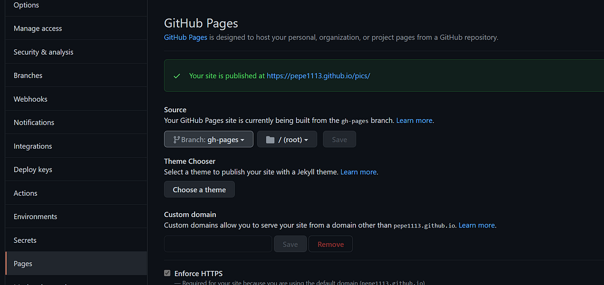
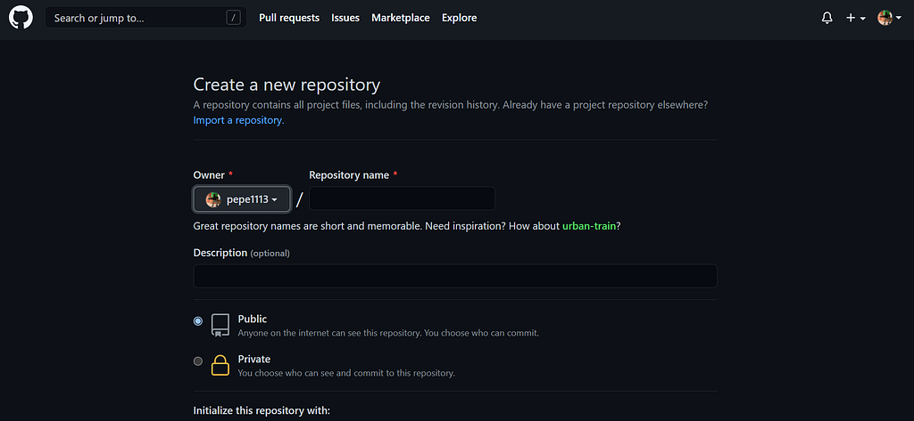

紀錄成功和失敗後找到解法的過程

過程全都是在專案資料夾內進行

## Github上新增專案



## 將專案推上github

```
//這段新增好專案後會出現:帳號名、檔名
git remote add origin git@github.com:username/檔名.git
git push -u origin master
```

## package.json

```json
{
  "name": "realtime-weather-app",
  "homepage": "https://myusername.github.io/my-app",
  // 這個檔案的pages網址:帳號名、檔名

  "scripts": {
    "predeploy": "npm run build",
    "deploy": "gh-pages -d build",
    // 添加上面兩個指令
  }
}
```

## 安裝gh-pages

```
npm install --save gh-pages
```

## 發布

若檔案更新也需要重新發布

```
npm run deploy
```

## 指向gh-pages

GitHub / Setting / Pages

Source的地方，改成 Branch:gh-pages



## 自己遇到的雷點

- API網站限制：要注意是否有限定網址需再做設定，做專案時可能只有設定local:3000

## fetch:A branch named 'gh-pages' already exists

- 解法：win10
- 討論：https://github.com/transitive-bullshit/react-modern-library-boilerplate/issues/15

pakege.json script加上指令，刪除gh-pages快取，再跑一次清除的指令

```json
"clean" : "gh-pages-clean"
```

終端機

```
npm run clean
```

重新安裝gh-page並發布

```
npm run deploy
```

## 其他按讚數很高的解法

```
rm -rf node_modules/gh-pages/.cache
```


手動刪除：Go to your project's **node_modules/gh-pages** and delete **'.cache'** folder.


```json
"deploy": "gh-pages -d build"
//這一行指令改成下面的指令

"deploy": "gh-pages -b master -d build",
```

add a script in package.json like this.

```json
"clean" : "gh-pages-clean"
```

So you'll just need to do npm run clean next time the cleaning is required.

```
// 第一個改成這樣
rm -rf node_modules/.cache/gh-pages/
```
